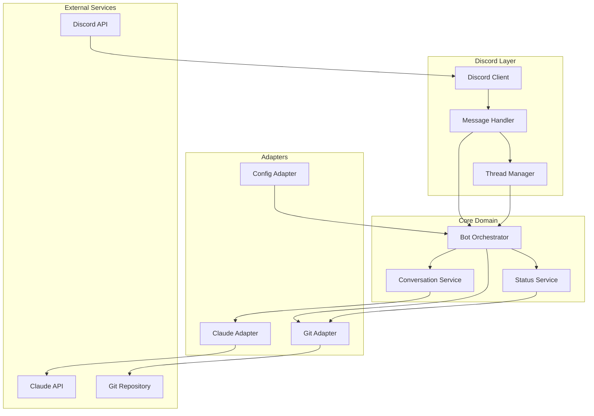
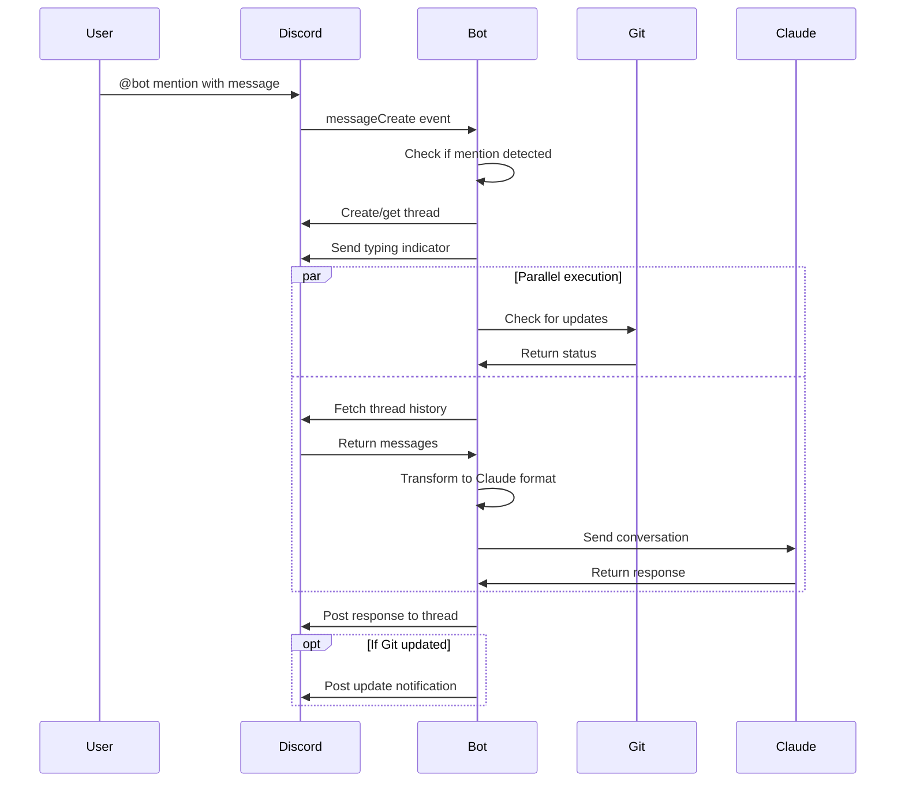

# Design Document

## Overview
**Purpose**: Discord-Claude-botは、DiscordユーザーがClaude AIとシームレスに対話できるインテグレーションボットである。Discord上でボットにメンションすることで、Claude AIの高度な言語処理能力を活用した応答を受け取れる。

**Users**: 開発チーム、プロジェクト管理者、一般的なDiscordユーザーがAI支援を必要とする際に利用する。コード生成、質問応答、文書作成などのタスクに活用される。

**Impact**: 現在のDiscordワークフローにAI機能を統合し、チーム全体の生産性と問題解決能力を向上させる。

**Deployment Environment**: ローカルPC上のDocker環境で24時間稼働
- VPS不要でコスト削減
- OAuth認証問題を完全回避
- Discord BotはWebSocket（アウトバウンド）のみで外部公開不要

### Goals
- Discord上でClaude AIとの自然な対話インターフェースを提供
- スレッド形式による文脈を保持した継続的な会話を実現
- Gitリポジトリ同期による常に最新のボット動作を保証
- ローカルDocker環境による低コスト運用と開発の容易性を実現
- Anthropic公式SDKを使用した安定したAPI統合

### Non-Goals
- VPSやクラウドサーバーへのデプロイ（ローカル環境を前提）
- Cloudflare Tunnelなどの外部公開機能（Discord BotはWebSocketのみ）
- 複数のDiscordサーバー（Guild）への同時デプロイ対応（Phase 1）
- 会話履歴の永続化とデータベース統合（Phase 2で検討）
- Claude APIストリーミング応答のリアルタイム表示（将来考慮）
- Web UIやダッシュボードの提供

## Architecture

### Architecture Pattern & Boundary Map



**Architecture Integration**:
- Selected pattern: Hexagonal Architecture（Ports & Adapters）
- Domain/feature boundaries:
  - Discord層: Discord APIとの直接通信を処理
  - Core Domain: ビジネスロジックと調整処理
  - Adapters: 外部サービスとの統合を抽象化
- Existing patterns preserved: 該当なし（新規プロジェクト）
- New components rationale: 各外部依存を分離し、テスト可能性と保守性を向上
- Steering compliance: 該当なし（ステアリングファイル未設定）

### Technology Stack

| Layer | Choice / Version | Role in Feature | Notes |
|-------|------------------|-----------------|-------|
| Frontend / CLI | Discord.js v14.24.2 | Discord APIクライアント、イベント処理 | Node.js 22.12.0以上必須 |
| Backend / Services | Node.js 22+ / TypeScript 5.x | アプリケーションランタイム | strict mode有効 |
| AI Integration | @anthropic-ai/sdk v0.30+ | Claude API統合 | 公式TypeScript SDK使用 |
| Data / Storage | In-memory (Phase 1) | 会話コンテキスト一時保存 | 永続化はPhase 2で検討 |
| Messaging / Events | Discord.js EventEmitter | 内部イベント伝達 | 標準的なNode.jsパターン |
| Infrastructure / Runtime | Docker Compose / node:22-slim | ローカルDocker環境 | docker-compose.ymlで管理 |
| Logging | Winston v3.x | 構造化ロギング | JSON形式、日次ローテーション |

**デプロイメント環境の特記事項:**
- **ローカルPC前提**: macOS、Linux、Windows + WSL2でDocker環境を使用
- **外部公開不要**: Discord BotはWebSocket（wss://gateway.discord.gg）へアウトバウンド接続のみ
- **認証方式**: Anthropic APIキー（環境変数`ANTHROPIC_API_KEY`）
- **ボリューム永続化**: `./volumes/` ディレクトリにログとGitリポジトリを保存

## System Flows

### メッセージ処理フロー


フロー決定事項:
- Git同期は非同期実行で応答速度を優先
- スレッド履歴取得は最大100メッセージに制限
- Claude API呼び出しは60秒でタイムアウト

## Requirements Traceability

| Requirement | Summary | Components | Interfaces | Flows |
|-------------|---------|------------|------------|-------|
| 1.1, 1.2, 1.3 | メンション検知とClaude中継、スレッド応答 | MessageHandler, BotOrchestrator, ClaudeAdapter | DiscordService, ClaudeService | メッセージ処理フロー |
| 1.4, 1.5 | 会話履歴管理と応答フォーマット | ConversationService, ThreadManager | ConversationMapper | メッセージ処理フロー |
| 2.1, 2.2, 2.3 | Git同期とリポジトリ管理 | GitAdapter, StatusService | GitSyncService | メッセージ処理フロー（Git部分） |
| 2.4, 2.5, 2.6 | Git更新通知と認証 | GitAdapter | GitSyncService | - |
| 3.1, 3.2, 3.3 | Claude API統合と会話コンテキスト | ClaudeAdapter, ConversationService | ClaudeService, ConversationMapper | メッセージ処理フロー |
| 3.4, 3.5, 3.6 | Claude応答処理とエラーハンドリング | ClaudeAdapter | ClaudeService | - |
| 4.1, 4.2, 4.3, 4.4, 4.5, 4.6 | ステータスコマンド | StatusService | StatusCommand | - |
| 5.1, 5.2, 5.3, 5.4, 5.5, 5.6 | 環境変数設定管理 | ConfigAdapter | ConfigService | - |
| 6.1, 6.2, 6.3, 6.4, 6.5, 6.6 | Dockerデプロイメント | - | - | - |
| 7.1, 7.2, 7.3, 7.4, 7.5, 7.6 | エラーハンドリング | 全コンポーネント | ErrorHandler | - |
| 8.1, 8.2, 8.3, 8.4, 8.5, 8.6 | スレッド管理 | ThreadManager | ThreadService | メッセージ処理フロー |
| 9.1, 9.2, 9.3, 9.4, 9.5, 9.6 | セキュリティ | ConfigAdapter, 全アダプター | - | - |

## Components and Interfaces

| Component | Domain/Layer | Intent | Req Coverage | Key Dependencies (P0/P1) | Contracts |
|-----------|--------------|--------|--------------|--------------------------|-----------|
| DiscordClient | Discord | Discord APIとの接続管理 | 1.1, 7.1 | discord.js (P0) | Service |
| MessageHandler | Discord | メッセージイベント処理 | 1.1, 1.2, 8.1 | DiscordClient (P0), BotOrchestrator (P0) | Service |
| ThreadManager | Discord | スレッド作成と管理 | 1.2, 8.1, 8.2, 8.3 | DiscordClient (P0) | Service |
| BotOrchestrator | Core | 全体フロー制御 | 1.3, 2.2, 2.3 | ConversationService (P0), GitAdapter (P1) | Service |
| ConversationService | Core | 会話履歴管理と変換 | 1.4, 3.2, 3.3 | ClaudeAdapter (P0) | Service |
| StatusService | Core | ステータス情報収集 | 4.1, 4.2, 4.3, 4.4 | GitAdapter (P1) | Service |
| ClaudeAdapter | Adapters | Claude API統合 | 3.1, 3.4, 3.5, 3.6 | @anthropic-ai/sdk (P0) | Service |
| GitAdapter | Adapters | Git操作実行 | 2.1, 2.3, 2.4, 2.5 | simple-git (P0) | Service |
| ConfigAdapter | Adapters | 環境変数管理 | 5.1, 5.2, 5.3, 5.4, 5.5, 5.6 | - | Service |

### Discord Layer

#### DiscordClient

| Field | Detail |
|-------|--------|
| Intent | Discord APIとの接続を確立し、イベントを受信する |
| Requirements | 1.1, 7.1 |

**Responsibilities & Constraints**
- Discord WebSocket接続の確立と維持
- 自動再接続処理の実装
- 必要なIntents（Guilds, GuildMessages, MessageContent）の設定

**Dependencies**
- External: discord.js v14.24.2 — Discord API統合 (P0)

**Contracts**: Service [x]

##### Service Interface
```typescript
interface DiscordClientService {
  connect(): Promise<void>;
  disconnect(): void;
  on(event: 'messageCreate' | 'error' | 'ready', handler: Function): void;
  getUser(): User | null;
}
```
- Preconditions: DISCORD_BOT_TOKEN環境変数が設定済み
- Postconditions: Discord WebSocket接続確立
- Invariants: 接続状態の一貫性維持

**Implementation Notes**
- Integration: discord.js Clientクラスをラップ
- Validation: トークン形式の検証
- Risks: ネットワーク断絶時の再接続失敗

#### MessageHandler

| Field | Detail |
|-------|--------|
| Intent | 受信メッセージを解析し、適切な処理を起動する |
| Requirements | 1.1, 1.2, 8.1 |

**Responsibilities & Constraints**
- ボットへのメンション検知
- コマンド解析（/status等）
- BotOrchestratorへの処理委譲

**Dependencies**
- Inbound: DiscordClient — メッセージイベント受信 (P0)
- Outbound: BotOrchestrator — メッセージ処理実行 (P0)
- Outbound: ThreadManager — スレッド作成/取得 (P0)

**Contracts**: Service [x]

##### Service Interface
```typescript
interface MessageHandlerService {
  handleMessage(message: Message): Promise<void>;
  isBotMention(message: Message): boolean;
  parseCommand(message: Message): Command | null;
}

interface Command {
  type: 'status' | 'chat';
  content: string;
  message: Message;
  thread?: ThreadChannel;
}
```
- Preconditions: メッセージオブジェクトが有効
- Postconditions: 適切な処理が起動される
- Invariants: ボット自身のメッセージは処理しない

**Implementation Notes**
- Integration: message.mentions.has()でメンション判定
- Validation: @here/@everyoneの除外
- Risks: 大量メンション時の処理遅延

#### ThreadManager

| Field | Detail |
|-------|--------|
| Intent | Discordスレッドの作成と管理を行う |
| Requirements | 1.2, 8.1, 8.2, 8.3 |

**Responsibilities & Constraints**
- 新規スレッド作成
- 既存スレッド取得
- スレッドメッセージ履歴読み込み（最大100件）

**Dependencies**
- Inbound: MessageHandler — スレッド操作要求 (P0)
- Outbound: DiscordClient — Discord API操作 (P0)

**Contracts**: Service [x]

##### Service Interface
```typescript
interface ThreadManagerService {
  createOrGetThread(message: Message): Promise<Result<ThreadChannel, ThreadError>>;
  fetchThreadHistory(thread: ThreadChannel, limit?: number): Promise<Result<Message[], ThreadError>>;
  sendToThread(thread: ThreadChannel, content: string): Promise<Result<Message, ThreadError>>;
  sendTypingIndicator(thread: ThreadChannel): Promise<void>;
  splitLongMessage(content: string): string[];
}
```
- Preconditions: メッセージがスレッド作成可能なチャンネル
- Postconditions: スレッドが利用可能状態
- Invariants: DMではスレッド作成しない

### Core Domain

#### BotOrchestrator

| Field | Detail |
|-------|--------|
| Intent | メッセージ処理の全体フローを制御する |
| Requirements | 1.3, 2.2, 2.3 |

**Responsibilities & Constraints**
- 処理フロー全体の調整
- 並列処理（Git同期とClaude API呼び出し）の管理
- エラー時の適切なフォールバック

**Dependencies**
- Inbound: MessageHandler — 処理要求受信 (P0)
- Outbound: ConversationService — Claude対話処理 (P0)
- Outbound: StatusService — ステータス情報取得 (P1)
- Outbound: GitAdapter — リポジトリ同期 (P1)

**Contracts**: Service [x]

##### Service Interface
```typescript
interface BotOrchestratorService {
  processMessage(command: Command): Promise<void>;
  processStatusCommand(command: Command): Promise<void>;
  processChatCommand(command: Command): Promise<void>;
}

type Result<T, E> =
  | { ok: true; value: T }
  | { ok: false; error: E };
```
- Preconditions: コマンドオブジェクトが有効
- Postconditions: 応答がスレッドに送信される
- Invariants: エラー時もボット動作は継続

**Implementation Notes**
- Integration: Promise.allで並列処理実行
- Validation: タイムアウト設定（60秒）
- Risks: 並列処理の競合状態

#### ConversationService

| Field | Detail |
|-------|--------|
| Intent | Discord会話をClaude API形式に変換し、応答を取得する |
| Requirements | 1.4, 3.2, 3.3 |

**Responsibilities & Constraints**
- Discord メッセージ配列をClaude形式に変換
- user/assistantロールの適切な割り当て
- 会話コンテキストのサイズ管理

**Dependencies**
- Inbound: BotOrchestrator — 会話処理要求 (P0)
- Outbound: ClaudeAdapter — Claude API呼び出し (P0)

**Contracts**: Service [x]

##### Service Interface
```typescript
interface ConversationServiceInterface {
  processConversation(
    messages: Message[],
    newMessage: string
  ): Promise<Result<string, Error>>;
}

interface ConversationMapper {
  toClaudeMessages(messages: Message[]): ClaudeMessage[];
  splitLongMessage(content: string): string[];
}

interface ClaudeMessage {
  role: 'user' | 'assistant';
  content: string;
}
```
- Preconditions: メッセージ配列が時系列順
- Postconditions: Claude形式のメッセージ配列生成
- Invariants: user/assistantロールが交互

### Adapters

#### ClaudeAdapter

| Field | Detail |
|-------|--------|
| Intent | Claude APIとの通信を管理する |
| Requirements | 3.1, 3.4, 3.5, 3.6 |

**Responsibilities & Constraints**
- Anthropic公式TypeScript SDKを使用したAPI呼び出し
- エラーハンドリング（レート制限、タイムアウト、認証エラー）
- 環境変数`ANTHROPIC_API_KEY`からの認証情報取得
- APIキー方式による安定した認証（OAuth不使用）

**Dependencies**
- Inbound: ConversationService — API呼び出し要求 (P0)
- External: @anthropic-ai/sdk v0.30+ — Claude API公式SDK (P0)

**Contracts**: Service [x]

##### Service Interface
```typescript
interface ClaudeAdapterService {
  sendMessage(
    messages: ClaudeMessage[]
  ): Promise<Result<ClaudeResponse, ClaudeError>>;
}

interface ClaudeResponse {
  content: string;
  usage?: {
    inputTokens: number;
    outputTokens: number;
  };
}

interface ClaudeError {
  type: 'rate_limit' | 'auth' | 'timeout' | 'unknown';
  message: string;
  status?: number;
}
```
- Preconditions: ANTHROPIC_API_KEY環境変数設定済み
- Postconditions: 応答またはエラーを返す
- Invariants: APIキーをログ出力しない

**Implementation Notes**
- Integration: claude-sonnet-4-5-20250929モデル使用
- Validation: APIエラーの適切な分類
- Risks: API料金の増大

#### GitAdapter

| Field | Detail |
|-------|--------|
| Intent | Gitリポジトリの操作を管理する |
| Requirements | 2.1, 2.3, 2.4, 2.5 |

**Responsibilities & Constraints**
- リポジトリのクローン/プル実行
- 更新状態の確認
- Personal Access Tokenによる認証

**Dependencies**
- Inbound: BotOrchestrator — 同期要求 (P1)
- Inbound: StatusService — ステータス取得要求 (P1)
- External: simple-git — Git操作ライブラリ (P0)

**Contracts**: Service [x]

##### Service Interface
```typescript
interface GitAdapterService {
  initializeRepository(): Promise<Result<void, Error>>;
  checkForUpdates(): Promise<Result<GitUpdateInfo, Error>>;
  pullChanges(): Promise<Result<GitPullResult, Error>>;
  getStatus(): Promise<Result<GitStatus, Error>>;
}

interface GitUpdateInfo {
  hasUpdates: boolean;
  behind: number;
  ahead: number;
}

interface GitPullResult {
  updated: boolean;
  summary: string;
  files: string[];
}

interface GitStatus {
  branch: string;
  clean: boolean;
  modified: string[];
  tracking?: string;
}
```
- Preconditions: GIT_REPOSITORY_URL環境変数設定済み
- Postconditions: リポジトリが最新状態
- Invariants: トークンをログ出力しない

**Implementation Notes**
- Integration: GITHUB_TOKENを使用したHTTPS認証
- Validation: Git操作のタイムアウト（30秒）
- Risks: merge conflict発生時の処理

#### ConfigAdapter

| Field | Detail |
|-------|--------|
| Intent | 環境変数と設定を管理する |
| Requirements | 5.1, 5.2, 5.3, 5.4, 5.5, 5.6, 10.2, 10.7 |

**Responsibilities & Constraints**
- 環境変数の読み込みと検証
- 必須設定の存在確認
- デフォルト値の適用

**Dependencies**
- Inbound: 全コンポーネント — 設定値取得 (P0)

**Contracts**: Service [x]

##### Service Interface
```typescript
interface ConfigAdapterService {
  validate(): Result<void, ConfigError[]>;
  get<T>(key: ConfigKey): T;
  getOptional<T>(key: ConfigKey, defaultValue: T): T;
}

enum ConfigKey {
  DISCORD_BOT_TOKEN = 'DISCORD_BOT_TOKEN',
  ANTHROPIC_API_KEY = 'ANTHROPIC_API_KEY',
  GITHUB_TOKEN = 'GITHUB_TOKEN',
  GIT_REPOSITORY_URL = 'GIT_REPOSITORY_URL',
  BOT_NAME = 'BOT_NAME',
  LOG_LEVEL = 'LOG_LEVEL',
  LOG_TO_FILE = 'LOG_TO_FILE',
  LOG_FILE_PATH = 'LOG_FILE_PATH',
  LOG_MAX_SIZE = 'LOG_MAX_SIZE',
  LOG_MAX_FILES = 'LOG_MAX_FILES',
  LOG_COMPRESS = 'LOG_COMPRESS',
  MAX_THREAD_HISTORY = 'MAX_THREAD_HISTORY'
}

interface ConfigError {
  key: ConfigKey;
  reason: 'missing' | 'invalid_format';
}
```
- Preconditions: プロセス起動時に実行
- Postconditions: 全必須設定が利用可能
- Invariants: 機密情報をログ出力しない

#### LoggerService

| Field | Detail |
|-------|--------|
| Intent | 構造化ログの出力とログファイル管理を行う |
| Requirements | 6.5, 7.3, 7.6, 9.2, 9.6, 10.1-10.10 |

**Responsibilities & Constraints**
- 標準出力とファイル出力の並列処理
- ログローテーションと圧縮
- 機密情報の自動マスキング
- 構造化ログ（JSON形式）の出力

**Dependencies**
- Inbound: 全コンポーネント — ログ出力要求 (P0)
- Outbound: ConfigAdapter — ログ設定取得 (P0)

**Contracts**: Service [x]

##### Service Interface
```typescript
interface LoggerService {
  debug(message: string, context?: LogContext): void;
  info(message: string, context?: LogContext): void;
  warn(message: string, context?: LogContext): void;
  error(message: string, error?: Error, context?: LogContext): void;
  maskSensitiveData(text: string): string;
}

interface LogContext {
  messageId?: string;
  threadId?: string;
  userId?: string;
  guildId?: string;
  operation?: string;
  duration?: number;
  [key: string]: any;
}

interface LogEntry {
  timestamp: string;
  level: 'debug' | 'info' | 'warn' | 'error';
  message: string;
  context?: LogContext;
  error?: {
    message: string;
    stack?: string;
  };
}
```
- Preconditions: ConfigAdapterが初期化済み
- Postconditions: ログが指定された出力先に記録される
- Invariants: 機密情報は常にマスクされる

**Implementation Notes**
- Integration: winston + winston-daily-rotate-fileを使用
- Validation: 機密情報パターンマッチング（正規表現）
- Risks: ディスク容量不足時の処理

## Data Models

### Domain Model

**会話エンティティ**
- ThreadConversation: スレッド単位の会話管理
  - threadId: string (Discord thread ID)
  - messages: Message[] (会話履歴)
  - lastActivity: Date
  - participants: User[]

**値オブジェクト**
- BotMention: メンション情報
- CommandType: コマンド種別
- GitUpdateSummary: Git更新サマリ

**ビジネスルール**
- スレッドごとに独立した会話コンテキスト
- 最大100メッセージまでの履歴保持
- ボット自身のメッセージは処理対象外

### Logical Data Model

**Structure Definition**:
- Message → Thread (多対1)
- Thread → Conversation (1対1)
- Conversation → ClaudeContext (1対1変換)

**Consistency & Integrity**:
- トランザクション境界: 各メッセージ処理単位
- 会話履歴の時系列整合性保証
- スレッドIDによる会話分離

## Error Handling

### Error Strategy
各層で適切にエラーをキャッチし、ユーザーフレンドリーなメッセージに変換して応答する。

### Error Categories and Responses
**User Errors** (4xx):
- 無効なコマンド → 使用方法をガイド
- 権限不足 → 必要な権限を案内

**System Errors** (5xx):
- Discord API障害 → 自動リトライ後、エラー通知
- Claude API障害 → エラーメッセージをスレッドに投稿
- Git操作失敗 → 失敗内容を通知、処理は継続

**Business Logic Errors** (422):
- スレッド作成不可 → DMでの制限を説明
- 履歴取得上限超過 → 最新100件で処理継続

### Monitoring
- 構造化ログ（JSON形式）による詳細な記録
- 環境変数LOG_LEVELで制御（debug/info/warn/error）
- Docker logsとファイル出力の両方をサポート

## Testing Strategy

### Unit Tests
- ConversationMapper: Discord→Claude形式変換ロジック
- ConfigAdapter: 環境変数検証ロジック
- MessageHandler: メンション検知とコマンド解析
- GitAdapter: Git URL生成とトークンマスキング
- Error handlers: 各種エラーケースの処理

### Integration Tests
- Discord API: スレッド作成と履歴取得フロー
- Claude API: 会話送信と応答受信フロー
- Git同期: clone/pull操作と状態確認フロー
- 環境変数: 必須設定の起動時検証フロー

### E2E Tests
- メンション→スレッド作成→Claude応答の完全フロー
- ステータスコマンド実行と情報表示フロー
- Git更新検知と通知フロー

## Security Considerations

### 認証情報管理
- 全APIキーは環境変数経由で管理
- トークンのログ出力を防ぐマスキング処理
- Dockerビルド時に認証情報を含めない

### アクセス制御
- Discord botの必要最小限の権限スコープ設定
- GitHubトークンはread-onlyアクセスに制限
- Claude API使用量の監視と制限

## Logging Implementation Policy

### ログレベルガイドライン

**DEBUG**:
- 開発・デバッグ用の詳細情報
- 関数の入出力パラメータ
- 内部状態の変更
- 本番環境では無効化推奨
```typescript
logger.debug('Processing message', { messageId, content: content.substring(0, 100) });
```

**INFO**:
- 正常な処理フロー
- 重要なビジネスイベント
- 起動/終了メッセージ
```typescript
logger.info('Thread created', { threadId, messageId, userId });
logger.info('Git sync completed', { branch, commits: updateCount });
```

**WARN**:
- 回復可能なエラー
- 予期しないが継続可能な状態
- パフォーマンス閾値の超過
```typescript
logger.warn('Rate limit approaching', { remaining: 10, reset: resetTime });
logger.warn('Git sync skipped due to conflicts', { branch, error: err.message });
```

**ERROR**:
- 処理失敗
- 例外発生
- ユーザー影響のあるエラー
```typescript
logger.error('Claude API request failed', error, { messageId, attempt: retryCount });
```

### ログ出力場所の方針

**各コンポーネントでのログ出力**:
```typescript
// MessageHandler
logger.info('Message received', {
  messageId: message.id,
  userId: message.author.id,
  channelType: message.channel.type,
  hasThread: message.channel.isThread()
});

// ClaudeAdapter
logger.info('Claude API request', {
  model: 'claude-3-opus',
  messageCount: messages.length,
  maxTokens: config.maxTokens
});

// GitAdapter
logger.info('Git operation started', {
  operation: 'pull',
  branch: currentBranch,
  repository: maskUrl(repoUrl)
});

// ThreadManager
logger.debug('Thread history fetched', {
  threadId: thread.id,
  messageCount: messages.length,
  oldestMessage: messages[0]?.createdAt
});
```

### 機密情報のマスキング

**自動マスキング対象**:
```typescript
const SENSITIVE_PATTERNS = [
  // Anthropic API Key
  { pattern: /sk-ant-[a-zA-Z0-9-_]{40,}/g, replacement: 'sk-ant-***' },
  { pattern: /ANTHROPIC_API_KEY=\S+/g, replacement: 'ANTHROPIC_API_KEY=***' },

  // Discord Token
  { pattern: /[MN][a-zA-Z\d_-]{23,25}\.[a-zA-Z\d_-]{6}\.[a-zA-Z\d_-]{27,}/g, replacement: 'DISCORD_TOKEN=***' },

  // GitHub Token
  { pattern: /ghp_[a-zA-Z0-9]{36,}/g, replacement: 'ghp_***' },
  { pattern: /github\.com\/[^:]+:([^@]+)@/g, replacement: 'github.com/***:***@' },

  // Generic Bearer tokens
  { pattern: /Bearer\s+[a-zA-Z0-9\-_]+/g, replacement: 'Bearer ***' }
];
```

### パフォーマンス考慮事項

**ログ出力の最適化**:
```typescript
// NG: 重い処理を毎回実行
logger.debug('Large object', JSON.stringify(largeObject));

// OK: debugレベルの時のみ実行
if (logger.isDebugEnabled()) {
  logger.debug('Large object', { summary: summarizeObject(largeObject) });
}

// OK: 大きなデータは要約
logger.info('Batch processed', {
  totalItems: items.length,
  firstItem: items[0],
  lastItem: items[items.length - 1]
});
```

### エラーログの構造

**標準エラーフォーマット**:
```typescript
interface ErrorLog {
  timestamp: string;
  level: 'error';
  message: string;
  error: {
    name: string;
    message: string;
    stack?: string;
    code?: string;
  };
  context: {
    operation: string;
    messageId?: string;
    threadId?: string;
    userId?: string;
    retryCount?: number;
  };
}
```

### ログローテーションポリシー

**ファイル管理**:
- 日次ローテーション: `bot-2025-11-16.log`
- サイズ制限: 10MB/ファイル
- 保持期間: 7日間
- 圧縮: 1日経過後にgzip圧縮
- パス: `/app/logs/`（Dockerボリュームマウント）

### 開発環境と本番環境の差異

**開発環境** (`NODE_ENV=development`):
- LOG_LEVEL=debug
- コンソール出力: カラー付き、整形済み
- ファイル出力: オプション
- スタックトレース: フル表示

**本番環境** (`NODE_ENV=production`):
- LOG_LEVEL=info
- コンソール出力: JSON形式
- ファイル出力: 必須
- スタックトレース: エラーレベルのみ

### ログ集約とモニタリング

**外部サービス連携の準備**:
```typescript
// 将来の拡張用インターフェース
interface LogTransport {
  send(log: LogEntry): Promise<void>;
}

// 実装例（将来対応）
class CloudWatchTransport implements LogTransport { }
class DatadogTransport implements LogTransport { }
class ElasticsearchTransport implements LogTransport { }
```

### データ保護
- 会話履歴はメモリのみ（Phase 1）
- 機密情報を含むメッセージの自動削除オプション
- HTTPS通信の強制

## Performance & Scalability

### Target Metrics
- メッセージ応答時間: 5秒以内（P50）
- 同時処理スレッド数: 10スレッド
- メモリ使用量: 512MB以下

### Optimization Strategies
- Git同期の非同期実行
- スレッド履歴の取得上限設定
- Docker multi-stage buildによるイメージサイズ削減
- NODE_ENV=productionによるメモリ最適化