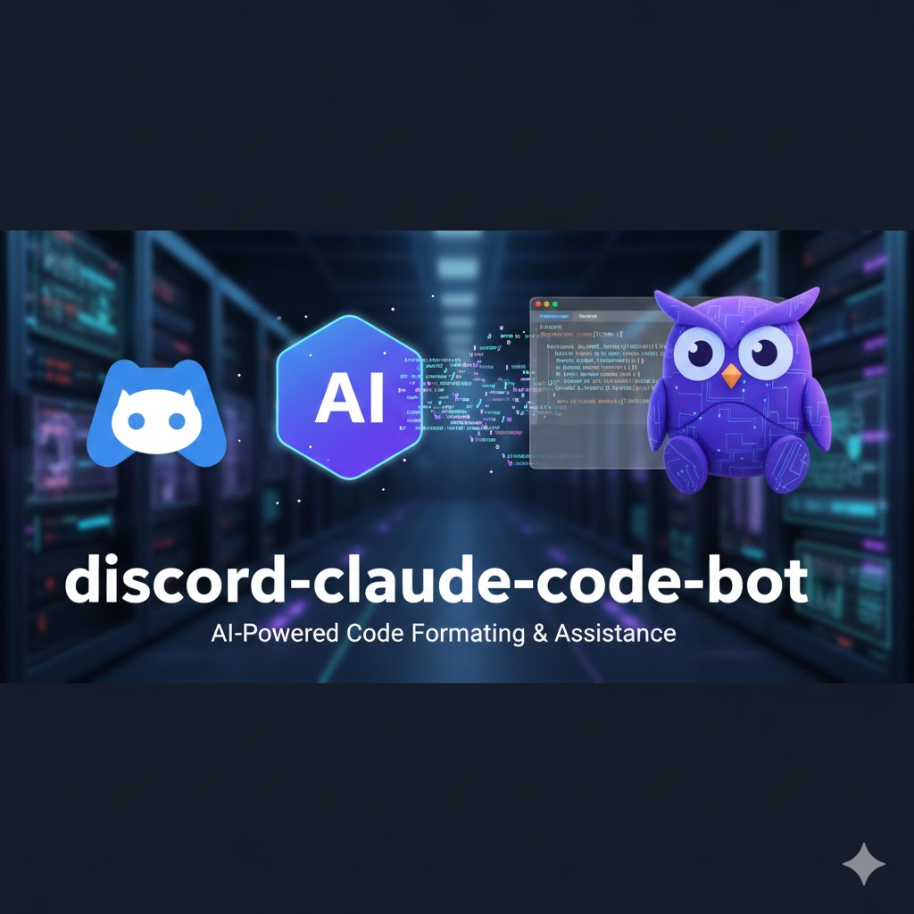

<div align="center">
  

# Discord Claude CLI Bot

[English](./README.md) | 日本語

Claude Code CLIを使用したDiscord Botシステム。Discord上でボットにメンションすることで、Claude Code CLIを通じてClaude AIとの対話を可能にし、スレッド形式で会話を継続できます。

</div>

## クイックスタート

3ステップでボットを起動：

```bash
# 1. トークン取得（任意の環境で1回のみ実行）
npm install -g @anthropic-ai/claude-code
claude auth login && claude setup-token  # CLAUDE_CODE_OAUTH_TOKENをコピー

# 2. クローンと設定
git clone https://github.com/hummer98/discord-claude-cli-bot.git
cd discord-claude-cli-bot
cp .env.docker.example .env.docker
# .env.dockerを編集: DISCORD_BOT_TOKEN、GIT_REPOSITORY_URL、CLAUDE_CODE_OAUTH_TOKENを設定

# 3. Docker起動
docker-compose up -d

# または Podman + Task（推奨）
task dev:build
```

**トークンの取得方法**
- Discord: [Botを作成](https://discord.com/developers/applications) → Botタブ → トークンをコピー
- Claude: `claude setup-token`を実行（Claude Pro/Max必須）または[APIキー](https://console.anthropic.com/)を使用
- GitHub: `gh auth token`（プライベートリポジトリのみ）

**試してみる:** Discordで `@あなたのBot こんにちは！` と入力すると、ボットがスレッドで応答します。

詳細なセットアップは下記の[詳細セットアップガイド](#クイックスタート-1)を参照してください。

## 特徴

- **Discord統合**: @メンション形式で自然にClaudeと対話
- **スレッド対応**: 会話履歴を保持した継続的な対話
- **Git連携**: リポジトリと自動同期してボットを最新化
- **Docker対応**: ローカル/クラウド/VPS、どこでも動作
- **簡単セットアップ**: docker-composeで1コマンド起動

## アーキテクチャ

### デプロイ環境

```
Docker対応環境（ローカル/クラウド/VPS）
└── Docker Container
    ├── Discord Bot (discord.js)
    ├── Claude Code CLI統合
    └── Git同期機能
```

**対応環境**:
- **ローカル環境**: macOS/Linux/Windows+WSL2
- **クラウド**: AWS ECS/Fargate、Google Cloud Run、Azure Container Instances
- **VPS**: ConoHa、さくらのVPS、任意のDocker対応VPS
- **PaaS**: Railway、Render、Fly.io

**重要**: Discord BotはWebSocket接続（アウトバウンド）のみのため、外部からアクセスされる必要がありません。ポート公開などの外部公開機能は不要です。

### 認証方式

- **Discord**: Bot Token
- **Claude**: OAuth Token方式
  - **推奨**: OAuth Token (`CLAUDE_CODE_OAUTH_TOKEN`) - Claude Pro/Max契約
  - **代替**: API Key (`ANTHROPIC_API_KEY`) - 従量課金
- **GitHub**: Personal Access Token（プライベートリポジトリ用）

このボットは**Claude Code CLI**を使用し、どの環境でも同じ認証方式で動作します。

## 前提条件

### コンテナランタイム（いずれか）

- **Docker**: Docker Engine + Docker Compose (Linux/クラウド) または Docker Desktop (macOS/Windows)
- **Podman（推奨）**: オープンソースのコンテナランタイム
  - macOS: `brew install podman`
  - Linux: パッケージマネージャーでインストール

### 開発ツール（オプション）

- **Task**: タスクランナー（ローカル開発時に便利）
  - macOS: `brew install go-task/tap/go-task`
  - Linux: [Taskfile installation](https://taskfile.dev/installation/)
- **Node.js 22+**: ローカル開発時に必要（コンテナ実行のみなら不要）
- **Git**: バージョン管理

### 稼働環境

- **24時間稼働可能な環境**:
  - ローカルPC（常時起動）
  - クラウド（AWS/GCP/Azure等）
  - VPS（ConoHa/さくら等）
  - PaaS（Railway/Render/Fly.io等）

> **推奨**: ローカル開発時は `task doctor` で環境確認

### 必要なトークン

1. **Discord Bot Token**
   - [Discord Developer Portal](https://discord.com/developers/applications)でアプリケーション作成
   - Botタブでトークンを生成
   - OAuth2 → URL Generatorで`bot`スコープ + 必要な権限を設定
   - 生成されたURLでサーバーに招待

2. **Claude Authentication** (いずれか一つ)

   **オプションA: OAuth Token（推奨）**
   - Claude Pro/Max契約が必要
   - トークン取得手順:
     ```bash
     # Claude Code CLIをインストール（任意の環境で実行）
     npm install -g @anthropic-ai/claude-code

     # OAuth認証
     claude auth login

     # OAuth トークン生成
     claude setup-token
     # → CLAUDE_CODE_OAUTH_TOKEN=sk-ant-oat01-xxxxx をコピー
     ```

   **オプションB: API Key（従量課金）**
   - [Anthropic Console](https://console.anthropic.com/)でAPIキーを生成
   - Claude Pro契約とは別の従量課金

3. **GitHub Token**（オプション）
   - プライベートリポジトリを同期する場合のみ必要
   - トークン取得手順:
     ```bash
     # GitHub CLIをインストール（任意の環境で実行）
     # macOS
     brew install gh
     # Linux/WSL
     sudo apt install gh

     # GitHub認証（初回のみ）
     gh auth login

     # トークンを取得
     gh auth token
     # → ghp_xxxxx をコピー
     ```
   - または [GitHub Settings → Developer settings → Personal access tokens](https://github.com/settings/tokens) で手動生成
   - `repo`スコープを選択

## クイックスタート

### 1. リポジトリのクローン

```bash
git clone https://github.com/yourusername/discord-claude-cli-bot.git
cd discord-claude-cli-bot
```

### 2. 認証トークンの取得

**重要**: トークン取得は任意の環境（ローカルPC等）で実行します。取得したトークンを環境変数として設定すればどこでも動作します。

```bash
# Claude Code CLI（Claude認証用）をインストール
npm install -g @anthropic-ai/claude-code

# Claude認証（OAuth Token - 推奨）
claude auth login
claude setup-token
# → 出力される CLAUDE_CODE_OAUTH_TOKEN=sk-ant-oat01-xxxxx をメモ

# GitHub CLI（推奨、GitHub認証用）をインストール
# macOS
brew install gh
# Linux/WSL
sudo apt install gh

# GitHub認証（プライベートリポジトリの場合）
gh auth login
gh auth token
# → 出力される ghp_xxxxx をメモ
```

### 3. プロジェクトのクローンとセットアップ

デプロイ先の環境で以下を実行:

```bash
# リポジトリをクローン
git clone https://github.com/yourusername/discord-claude-cli-bot.git
cd discord-claude-cli-bot
```

### 4. 環境変数の設定

```bash
# .env.dockerファイルを作成
cp .env.docker.example .env.docker
```

`.env.docker`ファイルを編集:

```bash
# 必須: Discord Bot Token (Discord Developer Portalで取得)
DISCORD_BOT_TOKEN=your_discord_bot_token_here

# 必須: Gitリポジトリ
GIT_REPOSITORY_URL=https://github.com/username/repo.git

# 必須: Claude認証（いずれか一つ）
# オプションA: OAuth Token (推奨、claude setup-token で取得)
CLAUDE_CODE_OAUTH_TOKEN=sk-ant-oat01-xxxxxxxxxxxxx

# オプションB: API Key (従量課金、Anthropic Consoleで取得)
# ANTHROPIC_API_KEY=sk-ant-api03-xxxxx

# オプション: GitHub認証 (gh auth token で取得、プライベートリポジトリ用)
GITHUB_TOKEN=ghp_xxxxx

# オプション: ログレベル
LOG_LEVEL=info          # debug, info, warn, error
```

### 5. 環境の確認（オプション）

**ローカル開発時（Podman + Task使用）**:

```bash
# 必要なソフトウェアとプロジェクト設定を確認
task doctor
```

**Docker使用時**:

```bash
# Dockerが正しくインストールされているか確認
docker --version
docker-compose --version
```

### 6. 起動

**Podman + Task使用時（推奨）**:

```bash
# イメージをビルドして起動
task dev:build

# ログを確認
task logs:follow
```

**Docker使用時**:

```bash
# バックグラウンドで起動
docker-compose up -d

# ログを確認
docker-compose logs -f discord-bot
```

### 7. Discordで試す

Discord サーバーで:

```
@ClaudeBot こんにちは！
```

ボットが自動的にスレッドを作成して応答します。スレッド内では@メンション不要で会話を継続できます。

## セットアップまとめ

完全なセットアップフロー:

```bash
# 1. 認証トークンの取得（任意の環境で実行、初回のみ）
npm install -g @anthropic-ai/claude-code
claude auth login && claude setup-token  # → CLAUDE_CODE_OAUTH_TOKEN をメモ

# GitHub CLI（プライベートリポジトリの場合）
brew install gh  # macOS または sudo apt install gh  # Linux
gh auth login && gh auth token           # → GITHUB_TOKEN をメモ

# 2. デプロイ先環境でプロジェクトのクローン
git clone https://github.com/yourusername/discord-claude-cli-bot.git
cd discord-claude-cli-bot

# 3. 環境変数の設定
cp .env.docker.example .env.docker
# .env.dockerファイルを編集してトークンを設定

# 4. Docker起動
# Podman + Task使用時
task dev:build
task logs:follow

# Docker Compose使用時
docker-compose up -d
docker-compose logs -f discord-bot
```

## 使い方

### 基本的な対話

```
# チャンネルで新しい会話を開始（スレッド作成）
@ClaudeBot TypeScriptでFizzBuzzを実装してください

# スレッド内で会話を継続（@メンション不要）
それをもっとシンプルにできますか？
```

### ステータス確認

```
@ClaudeBot status
```

以下の情報を表示:
- Gitブランチとステータス
- ボット稼働時間
- （将来）API使用状況

### Git同期

ボットは新しいスレッド作成時に自動的にGitリポジトリを同期します。更新があれば通知されます。

## ディレクトリ構造

```
discord-claude-cli-bot/
├── .env.docker             # Docker環境変数（.gitignore）
├── .env.docker.example     # Docker環境変数のテンプレート
├── docker-compose.yml      # Docker Compose設定
├── Dockerfile             # Dockerイメージ定義
├── package.json           # Node.js依存関係
├── tsconfig.json          # TypeScript設定
├── src/                   # ソースコード
│   ├── index.ts          # エントリーポイント
│   ├── adapters/         # 外部サービス統合
│   │   ├── discord-adapter.ts
│   │   ├── claude-adapter.ts
│   │   ├── git-adapter.ts
│   │   └── config-adapter.ts
│   ├── domain/           # コアビジネスロジック
│   │   ├── message-handler.ts
│   │   ├── thread-manager.ts
│   │   └── bot-orchestrator.ts
│   └── infrastructure/   # インフラ層
│       └── logger.ts
├── volumes/              # Docker永続化データ（.gitignore）
│   ├── logs/            # ログファイル
│   ├── repo/            # Gitリポジトリ
│   └── claude/          # Claude認証情報（OAuth使用時）
└── docs/                # ドキュメント
    ├── BOOT.md
    └── SETUP_CLAUDE_CLI.md
```

## 開発

### 環境チェック

```bash
# 必要なソフトウェアとプロジェクト設定を確認
task doctor
```

### ローカル開発環境

```bash
# 依存関係インストール
npm install

# 開発モード（ホットリロード）
npm run dev

# ビルド
npm run build

# 本番モード
npm start
```

### コンテナビルド

**Podman + Task使用時（推奨）**:

```bash
# イメージビルド
task build

# キャッシュなしで強制再ビルド
task build:nocache

# ビルドして起動
task dev:build

# 完全な再ビルドと再起動
task dev:rebuild
```

**Docker使用時**:

```bash
# イメージビルド
docker-compose build

# 強制再ビルド
docker-compose build --no-cache

# コンテナ再起動
docker-compose restart discord-bot
```

### ログ確認

**Podman + Task使用時（推奨）**:

```bash
# リアルタイムログ
task logs:follow

# ログ表示
task logs

# 最新100行
task logs:tail

# ファイルログ（ローカル）
tail -f volumes/logs/discord-bot-*.log
```

**Docker使用時**:

```bash
# リアルタイムログ
docker-compose logs -f discord-bot

# ファイルログ（ローカル）
tail -f volumes/logs/discord-bot-*.log

# 過去100行
docker-compose logs --tail=100 discord-bot
```

### その他の便利なコマンド（Task使用時）

```bash
# コンテナの状態確認
task ps

# リソース使用状況
task stats

# コンテナ内でシェルを起動
task shell

# コンテナ内でコマンド実行
task exec -- node --version

# 環境変数の確認
task env:check
```

## 運用

### 起動・停止

**Podman + Task使用時（推奨）**:

```bash
# 起動
task up

# 停止
task stop

# 再起動
task restart

# 停止して削除
task down

# 完全クリーンアップ
task clean

# 未使用リソースの削除
task prune
```

**Docker使用時**:

```bash
# 起動
docker-compose up -d

# 停止
docker-compose down

# 再起動
docker-compose restart

# 完全削除（ボリューム含む）
docker-compose down -v
```

### アップデート

**Podman + Task使用時（推奨）**:

```bash
# コードの更新
git pull origin main

# 再ビルドと再起動
task dev:rebuild
```

**Docker使用時**:

```bash
# コードの更新
git pull origin main

# 再ビルドと再起動
docker-compose up -d --build
```

### ログローテーション

ログは自動的にローテーションされます:
- **日次ローテーション**: 最大7日分保持
- **サイズローテーション**: 10MB超過で新ファイル
- **自動圧縮**: 古いログはgzip圧縮

### トラブルシューティング

#### ボットが起動しない

```bash
# ログ確認
docker-compose logs discord-bot

# コンテナ状態確認
docker-compose ps

# 環境変数確認
docker-compose config
```

#### 認証エラー

```
Error: Invalid Discord token
```

→ `.env.docker`の`DISCORD_BOT_TOKEN`を確認

```
Error: Invalid Anthropic API key
```

→ `.env.docker`の`ANTHROPIC_API_KEY`または`CLAUDE_CODE_OAUTH_TOKEN`を確認

#### Git同期エラー

```bash
# GitHubトークンの権限確認
# プライベートリポジトリの場合はGITHUB_TOKEN必須

# 手動でGit操作確認
docker exec -it discord-claude-cli-bot bash
cd /app/repo
git fetch
git status
```

## 設定

### 環境変数一覧

| 変数名 | 必須 | デフォルト | 説明 |
|--------|------|-----------|------|
| `DISCORD_BOT_TOKEN` | ✅ | - | Discord Bot Token |
| `CLAUDE_CODE_OAUTH_TOKEN` | ⚠️ | - | Claude OAuth Token (推奨) |
| `ANTHROPIC_API_KEY` | ⚠️ | - | Anthropic APIキー (代替認証) |
| `GIT_REPOSITORY_URL` | ✅ | - | 同期するGitリポジトリのURL |
| `GITHUB_TOKEN` | ❌ | - | GitHubアクセストークン（プライベートリポジトリ用） |
| `LOG_LEVEL` | ❌ | `info` | ログレベル（debug/info/warn/error） |
| `LOG_TO_FILE` | ❌ | `true` | ファイルログ出力の有無 |
| `LOG_FILE_PATH` | ❌ | `/app/logs` | ログファイルの保存先 |
| `MAX_THREAD_HISTORY` | ❌ | `50` | スレッド履歴の最大取得数 |

⚠️ Claude認証: `CLAUDE_CODE_OAUTH_TOKEN` または `ANTHROPIC_API_KEY` のいずれか一つが必須

### ボリュームマウント

```yaml
volumes:
  # ログファイル永続化
  - ./volumes/logs:/app/logs

  # Gitリポジトリ永続化
  - ./volumes/repo:/app/repo

  # Claude認証情報（OAuth使用時のみ）
  - ./volumes/claude:/root/.claude
```

## コスト

### デプロイ環境別のコスト

| 環境 | インフラ費用 | メリット | デメリット |
|------|-------------|---------|-----------|
| **ローカルPC** | 電気代500-1000円/月 | 開発体験良好、OAuth認証簡単 | PC常時起動必要 |
| **VPS** (ConoHa 1GB) | 968円/月 | 安定稼働、電気代不要 | サーバー管理必要 |
| **クラウド** (AWS Fargate等) | 使用量による（目安: $10-30/月） | 完全マネージド、高可用性 | やや高コスト |
| **PaaS** (Railway/Render) | 無料枠または $5-10/月 | 簡単デプロイ、自動スケール | 無料枠制限あり |

### 共通コスト

- **Claude API**: 従量課金（使った分だけ）
  - 例: 100万トークン = $3-15（モデルによる）
  - OAuth Token使用時はClaude Pro/Max契約が必要
- **Discord Bot**: 無料
- **GitHub**: 無料（パブリックリポジトリ）

## セキュリティ

### 認証情報の管理

- ✅ 環境変数で管理（`.env.docker`をgitignore）
- ✅ ログ出力時に自動マスキング
- ✅ コード内にハードコードしない
- ✅ クラウド環境ではSecrets Manager等を使用推奨

**クラウドデプロイ時の推奨**:
- **AWS**: Secrets Manager / Parameter Store
- **GCP**: Secret Manager
- **Azure**: Key Vault
- **Kubernetes**: Secrets
- **PaaS**: 各サービスの環境変数機能を使用

### ログのマスキング

以下のパターンを自動的にマスク:
- APIキー: `ANTHROPIC_API_KEY=***`, `sk-ant-***`
- Discordトークン: `DISCORD_BOT_TOKEN=***`
- GitHubトークン: `GITHUB_TOKEN=***`, `ghp_***`

### Docker Secrets（将来対応）

```yaml
secrets:
  discord_token:
    file: ./secrets/discord_token.txt
  anthropic_key:
    file: ./secrets/anthropic_key.txt
```

## Taskコマンド一覧

利用可能なすべてのタスクを確認:

```bash
task --list
```

主なコマンド:

| カテゴリ | コマンド | 説明 |
|---------|---------|------|
| **環境確認** | `task doctor` | 必要なソフトウェアとプロジェクト設定を確認 |
| **ビルド** | `task build` | イメージをビルド |
| | `task build:nocache` | キャッシュなしでビルド |
| **起動・停止** | `task up` | コンテナを起動 |
| | `task start` | 停止中のコンテナを開始 |
| | `task stop` | コンテナを停止 |
| | `task restart` | コンテナを再起動 |
| | `task down` | コンテナを停止して削除 |
| **ログ** | `task logs` | ログを表示 |
| | `task logs:follow` | ログをリアルタイムで表示 |
| | `task logs:tail` | 最新100行を表示 |
| **モニタリング** | `task ps` | コンテナの状態を表示 |
| | `task stats` | リソース使用状況を表示 |
| **開発** | `task dev:build` | ビルドして起動 |
| | `task dev:rebuild` | 再ビルドして再起動 |
| | `task shell` | コンテナ内でシェルを起動 |
| | `task exec -- <cmd>` | コンテナ内でコマンド実行 |
| **環境設定** | `task env:check` | 環境変数の設定を確認 |
| | `task env:setup` | .envファイルを作成 |
| **クリーンアップ** | `task clean` | コンテナとイメージを削除 |
| | `task prune` | 未使用リソースを削除 |
| **Compose** | `task compose:up` | Podman Composeで起動 |
| | `task compose:down` | Podman Composeを停止 |

## 技術スタック

- **Runtime**: Node.js 22 LTS
- **Language**: TypeScript 5.x
- **Discord**: discord.js v14.24
- **Claude**: Claude Code CLI (GitHub Actions style)
  - `@anthropic-ai/claude-code` (global install in Docker)
- **Git**: simple-git
- **Logging**: Winston v3.x
- **Container**: Podman / Docker
- **Task Runner**: Task (go-task)

## ライセンス

MIT License

## 参考ドキュメント

### その他
- [Discord Bot開発ガイド](https://discord.com/developers/docs)
- [Anthropic API Documentation](https://docs.anthropic.com/)

## トラブルシューティング

詳細なトラブルシューティングは[docs/](./docs/)ディレクトリのドキュメントを参照してください。

## サポート

Issue報告は[GitHub Issues](https://github.com/yourusername/discord-claude-cli-bot/issues)へお願いします。
